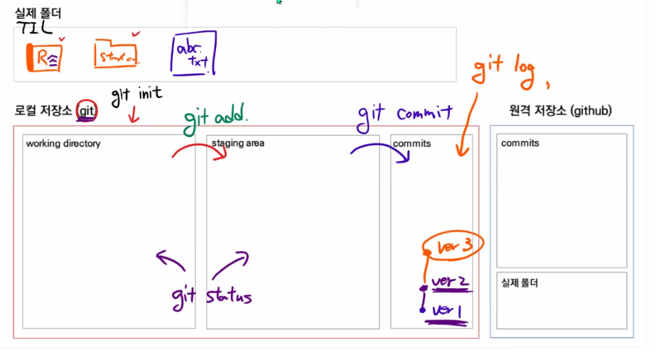

# Git & Github

## Why Git & Github?

### 1. Git 을 이용한 버전관리

#### Git ? (분산) 버전 관리 프로그램

- 버전 : 컴퓨터 소프트웨어의 특정 상태

- 관리 : 어떤 일의 사무, 시설이나 물건의 유지, 개량

- 프로그램 : 컴퓨터에서 실행될 때 특정 작업을 수행하는 일련의 명령어들의 모음

#### 중앙집중식 버전관리

#### 분산 버전 관리

### 2. Github를 이용한 포트폴리오

